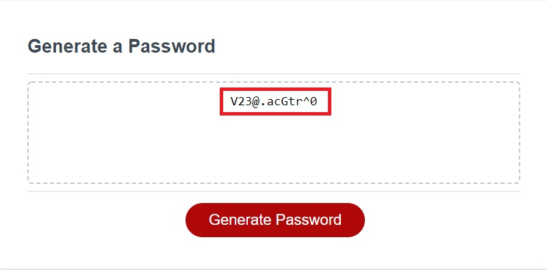

# Password-Generator
Application to generate a new secure password

Requirements
------------

No specific requirements.

This application was developed using HTML, CSS & Javascript.

Installation
------------

No installation needed.
This is a online password generator application.

Usage
------------
Pop up windows will let you decide the length and composition of your password:

Length could be from 8 to 128 characters.

Composition of the password will be asked by pop up windows too:

Lowercase:

Uppercase:

Numeric:

Special Characters:

The resulting password will be given within the dotted screen. You can select the password copy and paste where needed.

Password (enclosed in a red square just as a remark for the Readme file):

## License
Copyright (c) 11/06/2021 _Regulo Argotte_