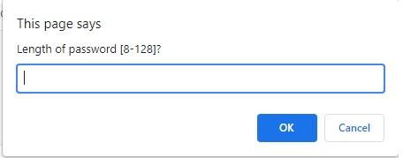

# Password-Generator
Application to generate a new secure password

Requirements
------------

No specific requirements.

This application was developed using HTML, CSS & Javascript.

Installation
------------

No installation needed.
This is a online password generator application.


Usage
------------
Pop up windows will let you decide the length and composition of your password:

Length could be from 8 to 128 characters.




More Passwords Usage
--------------------

If you want to generate 10 passwords that are 12 characters long.

```php
use Hackzilla\PasswordGenerator\Generator\ComputerPasswordGenerator;

$generator = new ComputerPasswordGenerator();

$generator
  ->setUppercase()
  ->setLowercase()
  ->setNumbers()
  ->setSymbols(false)
  ->setLength(12);

$password = $generator->generatePasswords(10);
```

Hybrid Password Generator Usage
-------------------------------

```php
use Hackzilla\PasswordGenerator\Generator\HybridPasswordGenerator;

$generator = new HybridPasswordGenerator();

$generator
  ->setUppercase()
  ->setLowercase()
  ->setNumbers()
  ->setSymbols(false)
  ->setSegmentLength(3)
  ->setSegmentCount(4)
  ->setSegmentSeparator('-');

$password = $generator->generatePasswords(10);
```

If you can think of a better name for this password generator then let me know.

The segment separator will be remove from the possible characters.


Human Password Generator Usage
-------------------------------

```php
use Hackzilla\PasswordGenerator\Generator\HumanPasswordGenerator;

$generator = new HumanPasswordGenerator();

$generator
  ->setWordList('/usr/share/dict/words')
  ->setWordCount(3)
  ->setWordSeparator('-');

$password = $generator->generatePasswords(10);
```

Requirement Password Generator Usage
------------------------------------

```php
use Hackzilla\PasswordGenerator\Generator\RequirementPasswordGenerator;

$generator = new RequirementPasswordGenerator();

$generator
  ->setLength(16)
  ->setOptionValue(RequirementPasswordGenerator::OPTION_UPPER_CASE, true)
  ->setOptionValue(RequirementPasswordGenerator::OPTION_LOWER_CASE, true)
  ->setOptionValue(RequirementPasswordGenerator::OPTION_NUMBERS, true)
  ->setOptionValue(RequirementPasswordGenerator::OPTION_SYMBOLS, true)
  ->setMinimumCount(RequirementPasswordGenerator::OPTION_UPPER_CASE, 2)
  ->setMinimumCount(RequirementPasswordGenerator::OPTION_LOWER_CASE, 2)
  ->setMinimumCount(RequirementPasswordGenerator::OPTION_NUMBERS, 2)
  ->setMinimumCount(RequirementPasswordGenerator::OPTION_SYMBOLS, 2)
  ->setMaximumCount(RequirementPasswordGenerator::OPTION_UPPER_CASE, 8)
  ->setMaximumCount(RequirementPasswordGenerator::OPTION_LOWER_CASE, 8)
  ->setMaximumCount(RequirementPasswordGenerator::OPTION_NUMBERS, 8)
  ->setMaximumCount(RequirementPasswordGenerator::OPTION_SYMBOLS, 8)
;

$password = $generator->generatePassword();
```

A limit can be removed by passing ```null```

```php
$generator
  ->setMinimumCount(RequirementPasswordGenerator::OPTION_UPPER_CASE, null)
  ->setMaximumCount(RequirementPasswordGenerator::OPTION_UPPER_CASE, null)
;
```

When setting the minimum and maximum values, be careful of unachievable settings.

For example the following will end up in an infinite loop.
```php
$generator
  ->setLength(4)
  ->setOptionValue(RequirementPasswordGenerator::OPTION_UPPER_CASE, true)
  ->setOptionValue(RequirementPasswordGenerator::OPTION_LOWER_CASE, false)
  ->setMinimumCount(RequirementPasswordGenerator::OPTION_UPPER_CASE, 5)
  ->setMaximumCount(RequirementPasswordGenerator::OPTION_LOWER_CASE, 1)
;
```

For the moment you can call ```$generator->validLimits()``` to test whether the counts will cause problems.
If the method returns true, then you can proceed. If false, then generatePassword() will likely cause an infinite loop.


Example Implementations
-----------------------

* Password Generator App [https://github.com/hackzilla/password-generator-app]
* Password Generator Bundle [https://github.com/hackzilla/password-generator-bundle]


Random Note
-------

Since version 1.5.0, the library depends on the presence of [random_int](http://www.php.net/random_int) which is found in PHP 7.0+

